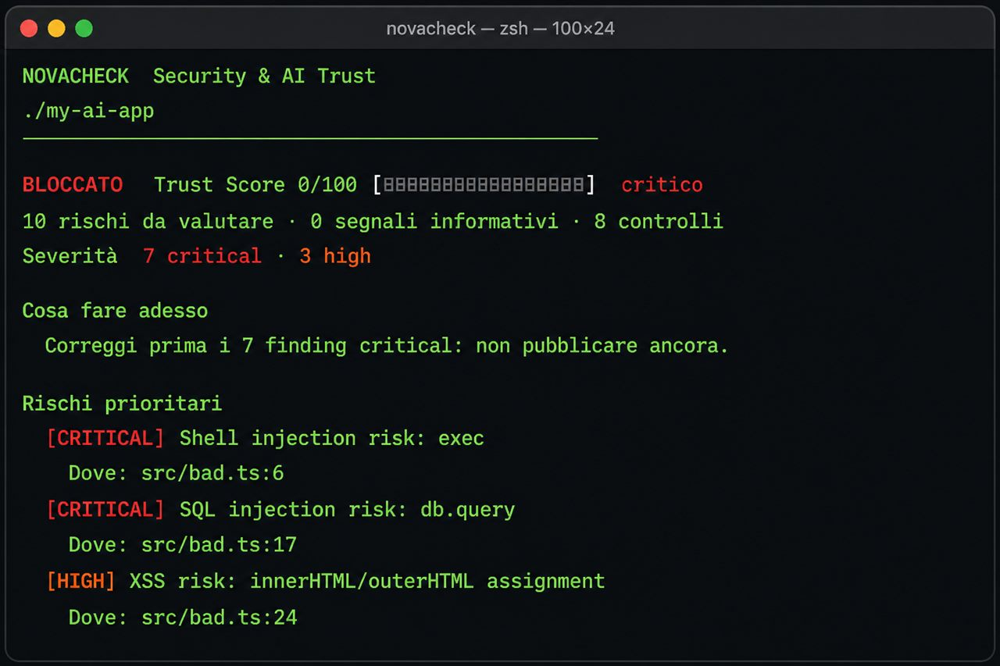
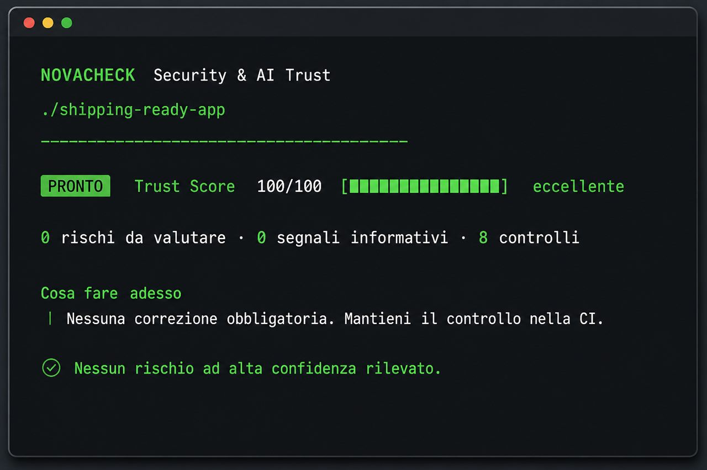
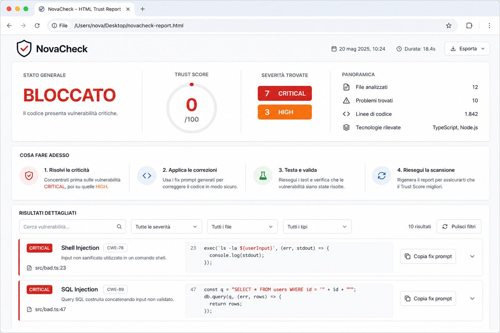

# NovaCheck

[](https://github.com/NovaCoding-G/NovaCheck/actions/workflows/ci.yml)
[](https://www.npmjs.com/package/novacheck)
[](https://www.npmjs.com/package/novacheck)
[](./LICENSE)
[](https://nodejs.org)
[](https://www.typescriptlang.org/)
[](https://docs.github.com/en/code-security/code-scanning)
[](#privacy--design-principles)
[](https://www.npmjs.com/package/novacheck)
[](https://github.com/NovaCoding-G/NovaCheck)

<p align="center">
  
  
</p>

> NovaCheck detects **explicit AI provenance**, not unreliable writing-style guesses.
> Source code stays on your machine. Network access is only used for package
> registry metadata (package names only), and can be turned off with `--offline`.

---

## Why NovaCheck exists

I build with AI every day. The loop is addictive: describe a feature, accept the
diff, move on. The code often *works*. That is exactly the problem.

AI is excellent at producing plausible patterns and terrible at owning the
consequences. In real projects I kept seeing the same class of mistakes:

- a dependency name that looked right and did not exist on npm (slopsquatting);
- `exec(\`rm -rf ${userInput}\`)` because “it just works”;
- SQL built with string concatenation instead of bound parameters;
- API keys pasted into `.env.example` “for convenience”;
- `Math.random()` used to mint tokens;
- `postinstall` scripts copied from a random gist;
- AI-authored hunks merged with nobody ever reading them.

Traditional scanners were either too noisy, too generic, or blind to the AI
workflow itself. I wanted something I would actually run before every push:

1. **local-first** — no uploading the repo to a third party;
2. **high precision** — fewer findings, but ones you should fix;
3. **actionable** — every issue comes with a fix prompt you can paste into your AI;
4. **CI-native** — policy, SARIF, and GitHub Action so “looks fine locally”
   is not the only gate.

NovaCheck is that tool. It is the review pass I wish I had the first time an
AI-generated dependency almost shipped.

<p align="center">
  
</p>

---

## What you get

| Output | Purpose |
| --- | --- |
| Trust Score `0–100` | Instant go / no-go signal for shipping |
| Terminal report | Priority findings + next steps in the CLI |
| HTML report | Shareable, filterable review in the browser |
| Fix prompts | Copy into Cursor / Copilot / ChatGPT to remediate |
| SARIF | GitHub Code Scanning annotations on PRs |
| Badge (opt-in) | `` for the README |

<p align="center">
  
</p>

The HTML report is written by default to `.novacheck/report.html`.
Use `--no-html` to skip it, or `--html path` to choose another location.

---

## What it catches

NovaCheck is optimized for **AI-shaped risk**, not every theoretical CVE.

| Detector | What it looks for |
| --- | --- |
| `ghost-deps` | Hallucinated / typosquatted npm & PyPI packages |
| `secrets` | Hardcoded credentials (secretlint + entropy) |
| `env-leak` | `.env` files that are unprotected or already tracked by Git |
| `supply-chain` | Dangerous lifecycle scripts, `git+http://` deps |
| `dangerous-sinks` | Shell/SQL injection, CORS `*`, TLS verify off, `eval`, XSS sinks, unsafe pickle/YAML |
| `insecure-crypto` | Weak crypto and predictable tokens in security context |
| `ai-unreviewed` | AI-authored ranges without human review (Agent Trace / SPDX) |
| `ai-presence` | Explicit AI markers (`Generated by Cursor`, `AI_DISCLOSURE.md`, trailers) |

`ai-presence` is informational by design: disclosure is good. It does not tank
the Trust Score. `ai-unreviewed` is the actionable provenance signal.

---

## Quick start

Requires **Node.js 20+**.

```bash
# one-shot, no global install
npx novacheck .

# only files changed vs main
npx novacheck . --changed origin/main

# fully offline (skip registry lookups)
npx novacheck . --offline

# fail CI under a score threshold
npx novacheck . --fail-below 85 --sarif

# fail closed if a file or registry package could not be analyzed
npx novacheck . --fail-on-incomplete
```

### Useful flags

```bash
npx novacheck . --verbose
npx novacheck . --html .novacheck/report.html
npx novacheck . --sarif ./results.sarif
npx novacheck . --badge
npx novacheck . --policy .novacheck.yml
npx novacheck --version
```

---

## Pull request scanning

Scan only what a branch introduced, then upload SARIF to GitHub Code Scanning:

```bash
npx novacheck . --changed origin/main --sarif
```

Reusable GitHub Action (after you publish or fork the repo):

```yaml
name: NovaCheck

on:
  pull_request:
  push:
    branches: [main]

permissions:
  contents: read
  security-events: write

jobs:
  trust:
    runs-on: ubuntu-latest
    steps:
      - uses: actions/checkout@d23441a48e516b6c34aea4fa41551a30e30af803 # v6
        with:
          fetch-depth: 0
      - uses: NovaCoding-G/NovaCheck@v0.4.0
        with:
          fail-below: "85"
          fail-on-incomplete: "true"
          changed: "true"
          base: "origin/main"
```

The Action fails the job when policy is violated. SARIF upload is skipped on
fork PRs that lack `security-events: write`, so external contributors do not
break CI for a permissions issue.

`changed: true` reports only risks attached to files introduced by the pull
request. It is intentionally a diff gate, not a full-repository certification.
Run an additional full scan on `main` (and optionally on a schedule):

```yaml
- uses: NovaCoding-G/NovaCheck@v0.4.0
  with:
    changed: "false"
    fail-below: "85"
    fail-on-incomplete: "true"
```

Release Action tags execute the same exact npm package as `npx novacheck`.

---

## Policy

Create `.novacheck.yml` in the project root:

```yaml
minimumScore: 85
failOnIncomplete: true
failOn:
  - critical
ignore:
  detectors:
    - ai-presence          # transparency, not a vuln
  findings:
    - dangerous-sinks/example-approved-risk
  paths:
    - tests/fixtures/**
    - "**/*.test.ts"
```

CLI flags override policy when both are set (e.g. `--fail-below`).
Local scans warn on incomplete analysis by default; CI should set
`failOnIncomplete: true` (or use `--fail-on-incomplete`) to fail closed.

---

## Trust Score

Findings subtract from 100 by severity:

| Severity | Weight |
| --- | --- |
| critical | −25 |
| high | −12 |
| medium | −5 |
| low | −2 |
| info | 0 |

Status in the UI follows your policy (`minimumScore` / `failOn`), not a hard-coded vanity threshold.

---

## Privacy & design principles

- **Local-first** — analysis runs on your machine / CI runner.
- **No style heuristics** — we do not guess “this looks AI-written”.
- **Provenance when available** — Agent Trace, SPDX-AI-Disclosure, commit trailers, explicit markers.
- **Precision over feature count** — noisy detectors get fixed or removed (e.g. version-blind CVE lookup was dropped).
- **Fix prompts included** — the tool should shorten the loop, not only shame the score.

---

## Development

Runtime for published packages: Node.js 20+.  
Development uses [Bun](https://bun.sh):

```bash
bun install
bun run check          # typecheck + tests + build + CLI smoke
bun run src/cli.ts . --offline --allow-incomplete
```

Maintainers: see [the release runbook](./docs/releasing.md) and
[CHANGELOG.md](./CHANGELOG.md).

---

## Security

Please do not disclose vulnerabilities in public issues. Follow
[SECURITY.md](./SECURITY.md).

---

## License

MIT © [NovaCoding-G](https://github.com/NovaCoding-G) · novacodingg@gmail.com
